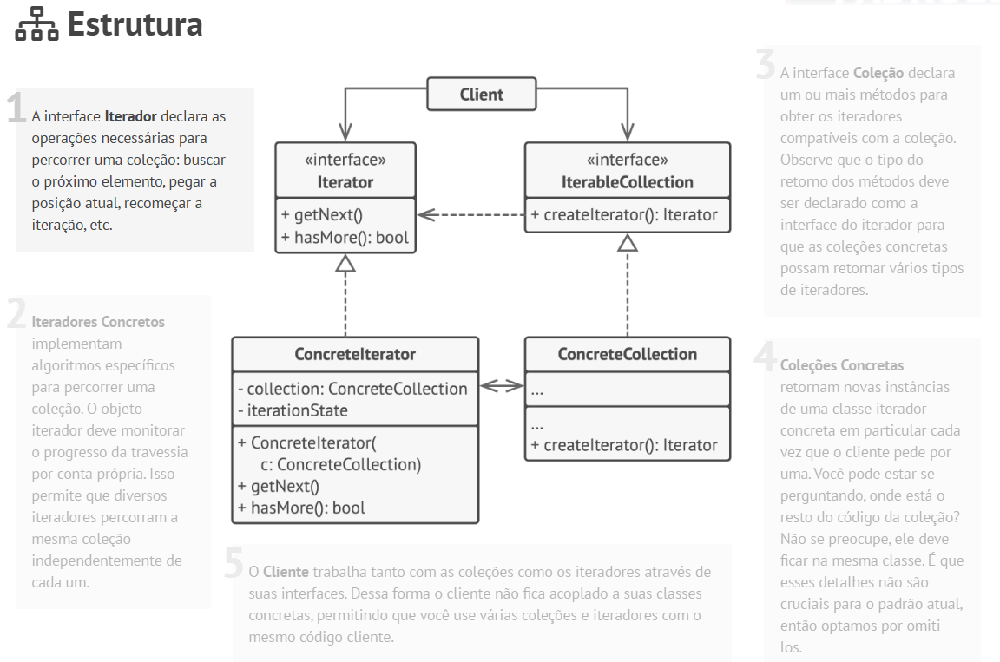

# Padrão de Projeto - Iterator (GoF)

Este repositório apresenta o estudo e a implementação do padrão comportamental **Iterator**, demonstrando sua importância na desconexão entre algoritmos e estruturas de dados.

## 🧭 O que é o Iterator?

O **Iterator** é um padrão de projeto comportamental que permite a você percorrer elementos de uma coleção sem expor a sua representação subjacente (seja ela uma lista, pilha, árvore ou grafo).

## Problema
Coleções são um dos tipos de dados mais usados em programação. Não obstante, uma coleção é apenas um contêiner para um grupo de objetos.
A maioria das coleções armazena seus elementos em listas simples. Contudo, alguns deles são baseados em pilhas, árvores, grafos, e outras estruturas complexas de dados.

Mas independente de quão complexa uma coleção é estruturada, ela deve fornecer uma maneira de acessar seus elementos para que outro código possa usá-los. Deve haver uma maneira de ir de elemento em elemento na coleção sem ter que acessar os mesmos elementos repetidamente.

Isso parece uma tarefa fácil se você tem uma coleção baseada numa lista. Você faz um loop em todos os elementos. Mas como você faz a travessia dos elementos de uma estrutura de dados complexas sequencialmente, tais como uma árvore. Por exemplo, um dia você pode apenas precisar percorrer em profundidade em uma árvore. No dia seguinte você pode precisar percorrer na amplitude. E na semana seguinte, você pode precisar algo diferente, como um acesso aleatório aos elementos da árvore.

Adicionando mais e mais algoritmos de travessia para uma coleção gradualmente desfoca sua responsabilidade primária, que é um armazenamento de dados eficiente. Além disso, alguns algoritmos podem ser feitos para aplicações específicas, então incluí-los em uma coleção genérica pode ser estranho.

Por outro lado, o código cliente que deveria trabalhar com várias coleções pode não se importar com a maneira que elas armazenam seus elementos. Contudo, uma vez que todas as coleções fornecem diferentes maneiras de acessar seus elementos, você não tem outra opção além de acoplar seu código com as classes de coleções específicas.

## Solução
A ideia principal do padrão Iterator é extrair o comportamento de travessia de uma coleção para um objeto separado chamado um iterador.
Além de implementar o algoritmo em si, um objeto iterador encapsula todos os detalhes da travessia, tais como a posição atual e quantos elementos faltam para chegar ao fim. Por causa disso, alguns iteradores podem averiguar a mesma coleção ao mesmo tempo, independentemente um do outro.

Geralmente, os iteradores fornecem um método primário para pegar elementos de uma coleção. O cliente pode manter esse método funcionando até que ele não retorne mais nada, o que significa que o iterador atravessou todos os elementos.

Todos os iteradores devem implementar a mesma interface. Isso faz que o código cliente seja compatível com qualquer tipo de coleção ou qualquer algoritmo de travessia desde que haja um iterador apropriado. Se você precisar de uma maneira especial para a travessia de uma coleção, você só precisa criar uma nova classe iterador, sem ter que mudar a coleção ou o cliente.

### 🧱 Estrutura do Padrão

O padrão é composto por quatro elementos principais:
1. **Iterator (Interface):** Define as operações para percorrer a coleção (ex: `hasMore()`, `next()`).
2. **Concrete Iterator:** Implementa o algoritmo de iteração específico para uma coleção.
3. **Iterable Collection (Interface):** Define o método para criar/obter um iterador.
4. **Concrete Collection:** Retorna uma nova instância do iterador concreto associado à sua estrutura.

## 📌 Prós e contras

 ✅ Princípio de responsabilidade única. Você pode limpar o código cliente e as coleções ao extrair os pesados algoritmos de travessia para classes separadas.

 ✅Princípio aberto/fechado. Você pode implementar novos tipos de coleções e iteradores e passá-los para o código existente sem quebrar coisa alguma.

 ✅Você pode iterar sobre a mesma coleção em paralelo porque cada objeto iterador contém seu próprio estado de iteração.
 
 ✅Pelas mesmas razões, você pode atrasar uma iteração e continuá-la quando necessário.

 ❌ Aplicar o padrão pode ser um preciosismo se sua aplicação só trabalha com coleções simples.

 ❌ Usar um iterador pode ser menos eficiente que percorrer elementos de algumas coleções especializadas diretamente.

 ## Padrões relacionados
>Composite (160): os Iterators são freqüentemente aplicados a estruturas recursivas, tais
como Composites.
>Factory Method (112): os Iteradores polimórficos dependem de métodos fábrica
para instanciar a subclasse apropriada de Iterator.
>Memento (266) é freqüentemente usado em conjunto com o padrão Iterator. Um
iterador pode usar um Memento para capturar o estado de uma iteração. O iterador
armazena internamente o memento, OU seja O Iterator cria um objeto opaco (o Memento) que guarda a posição atual. O código externo segura esse objeto, mas não consegue ver o que tem dentro dele. Mais tarde, basta passar esse Memento de volta para o Iterator, e ele restabelece a iteração de onde parou.

## Conclusões do sobre Iterator

"O padrão Iterator mostra-se indispensável no desenvolvimento de sistemas robustos e extensíveis. Ele resolve o problema clássico do acoplamento entre a representação de dados e a lógica de negócios. Embora linguagens modernas (como JavaScript/TypeScript, Java e C#) já tragam implementações nativas e sintaxes facilitadas para iteração (como o Symbol.iterator no JS ou a interface Iterable no Java), compreender a mecânica por trás do padrão GoF é fundamental para entender como criar APIs limpas, desacopladas e prontas para evolução de infraestrutura."

## Fontes

`https://refactoring.guru/pt-br/design-patterns/iterator`

`livro código limpo`

## Autoria: Maiara Torchelsen Saraiva